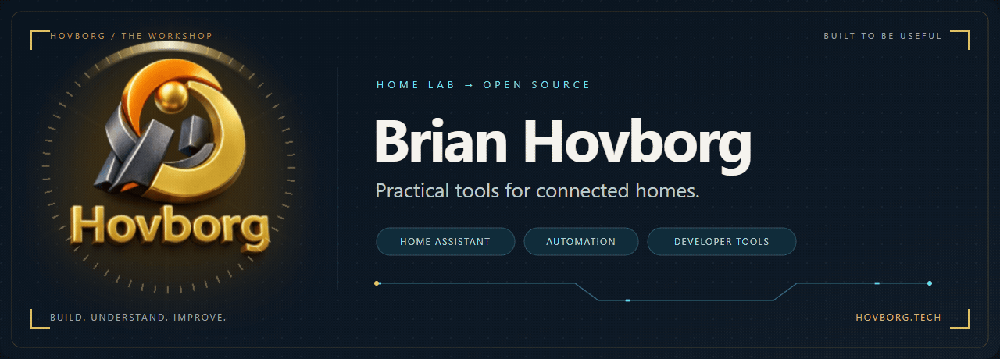
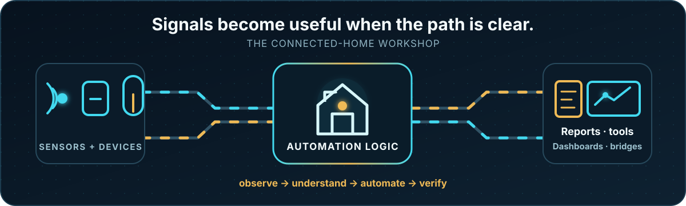

  <a href="https://hovborg.github.io/Hovborg/" title="Open the interactive Hovborg logo">
    <picture>
      <source media="(prefers-reduced-motion: reduce)" srcset="assets/hero.png">
      
    </picture>
  </a>

  <a href="https://hovborg.tech"><strong>hovborg.tech</strong></a>
  &nbsp;·&nbsp;
  <a href="https://smartbolig.net"><strong>smartbolig.net</strong></a>
  &nbsp;·&nbsp;
  <a href="#projects"><strong>Projects</strong></a>
  &nbsp;·&nbsp;
  <a href="#guides"><strong>Guides</strong></a>

  I build small, practical tools around Home Assistant, Windows and the devices people already own. 
  The common thread is simple: understand the signal, make the behavior useful, and document the path from setup to result.

## From the workshop

Two tools that grew from everyday work in my home lab, packaged with examples and step-by-step guides for other people to use.

### [Automation Lens](https://github.com/Hovborg/automation-lens)

Explore how your Home Assistant automations connect. Trace entities and actions, inspect potential loops and conflicting writes, and try a fictional home before connecting your own. **Read-only analysis · English reports · Offline demo · Python**

[Explore the project →](https://github.com/Hovborg/automation-lens) &nbsp; [English guide](https://github.com/Hovborg/automation-lens/blob/main/docs/GUIDE.md) · [Dansk guide](https://github.com/Hovborg/automation-lens/blob/main/docs/GUIDE.da.md)

### [AI Manager for Windows](https://github.com/Hovborg/ai-manager-windows)

See installed versions, available updates, release notes and update history in one Windows dashboard. Check versions whenever you want; install updates with an explicit click. **Windows · PowerShell · Danish interface · English and Danish guides**

[Explore the project →](https://github.com/Hovborg/ai-manager-windows) &nbsp; [English guide](https://github.com/Hovborg/ai-manager-windows/blob/main/docs/GUIDE.md) · [Dansk guide](https://github.com/Hovborg/ai-manager-windows/blob/main/docs/GUIDE.da.md)

  

## Connected-home projects

| Project | What it is for |
| :--- | :--- |
| **[Intex Pool](https://github.com/Hovborg/intex-pool)** | A Home Assistant integration and dashboard card for Intex and AGP pool equipment, including water monitoring, saltwater systems and pump control. |
| **[UniFi Protect Bridge](https://github.com/Hovborg/unifi-protect-bridge)** | Connects UniFi Protect webhooks and detections to Home Assistant sensors, events and automations. |
| **[UniFi Protect Bridge CLI](https://github.com/Hovborg/unifi-protect-bridge-cli)** | A companion command-line tool for inspecting cameras and managing bridge-owned webhooks. |
| **[SmartBolig](https://github.com/Hovborg/smartbolig-starlight)** | The Astro Starlight source for practical smart-home guides in Danish and English at [smartbolig.net](https://smartbolig.net). |
| **[Family Safety — fixed fork](https://github.com/Hovborg/ha-familysafety-fixed)** | A maintained fork of the archived Microsoft Family Safety integration, with a focused repair to its OAuth login flow. Original project credit and history remain in the fork. |
| **[Multi-agent](https://github.com/Hovborg/multi-agent)** | A catalog of AI-agent patterns and framework adapters. |

## Guides before guesswork

The projects are built around reproducible setup and honest verification. Start with the guide for the project you are using; when something fails, include the version, the relevant setup, and the shortest sequence that reproduces it.

- **Smart-home guides:** [smartbolig.net](https://smartbolig.net)
- **Automation Lens:** [English](https://github.com/Hovborg/automation-lens/blob/main/docs/GUIDE.md) · [Dansk](https://github.com/Hovborg/automation-lens/blob/main/docs/GUIDE.da.md)
- **AI Manager for Windows:** [English](https://github.com/Hovborg/ai-manager-windows/blob/main/docs/GUIDE.md) · [Dansk](https://github.com/Hovborg/ai-manager-windows/blob/main/docs/GUIDE.da.md)

Bug reports, focused fixes and documentation improvements are welcome in the relevant repository.

  

